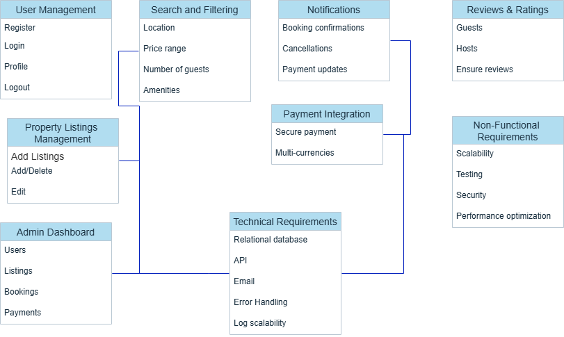

# Airbnb Clone – Backend Features and Functionalities

This document outlines the key features and technical requirements of the backend system for the Airbnb Clone project.

## Features Diagram

## Description

The backend system supports user registration, property listings, booking, payments, reviews, notifications, and an admin dashboard. It also includes technical requirements such as secure authentication, RESTful APIs, database design, scalability, and performance optimization.
